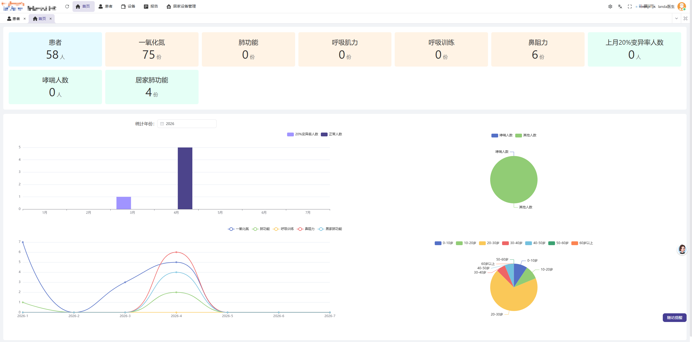
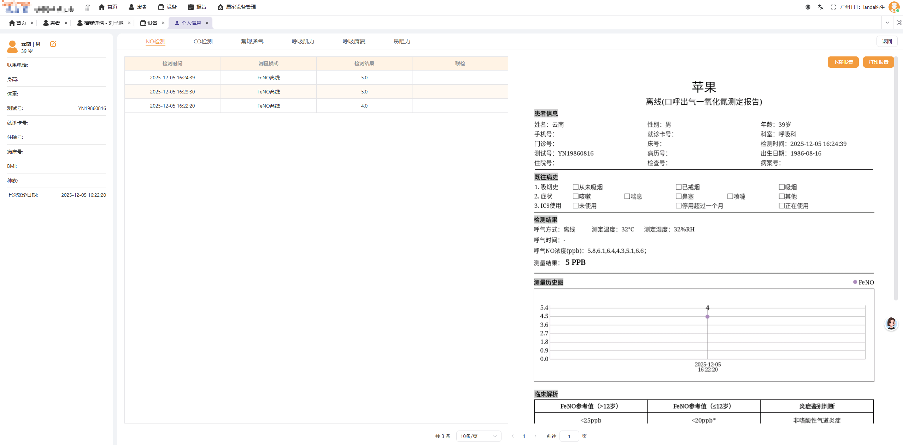
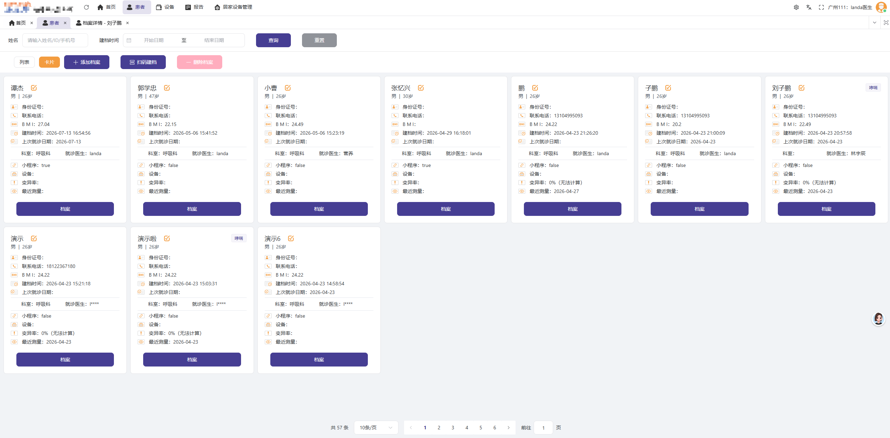
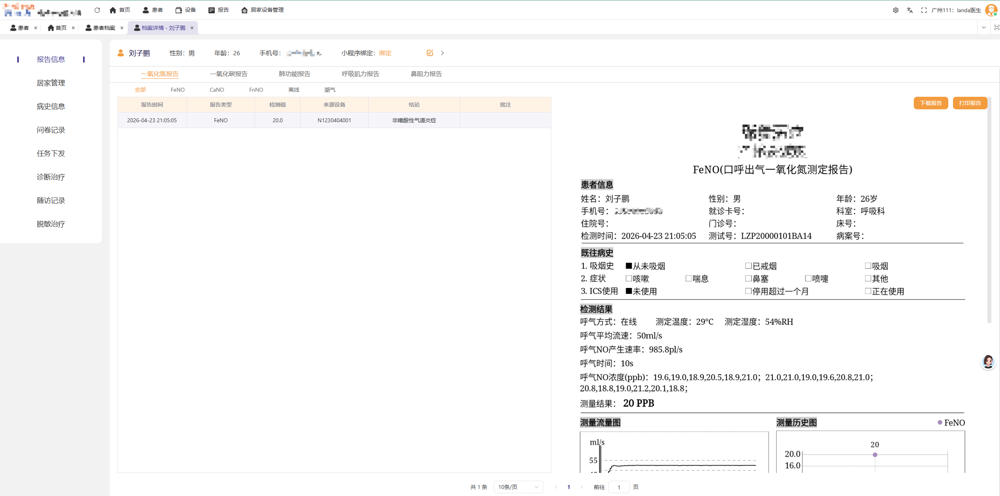
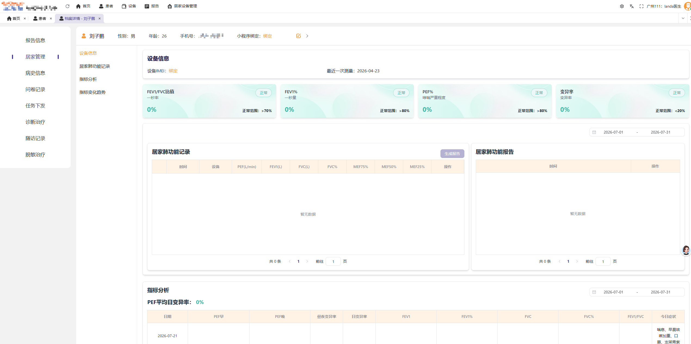
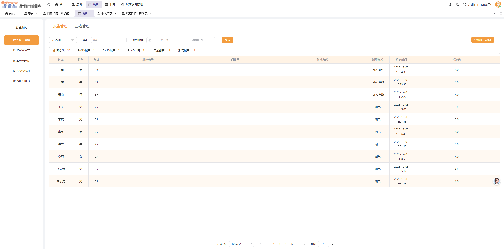
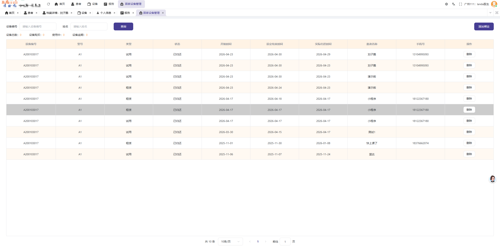
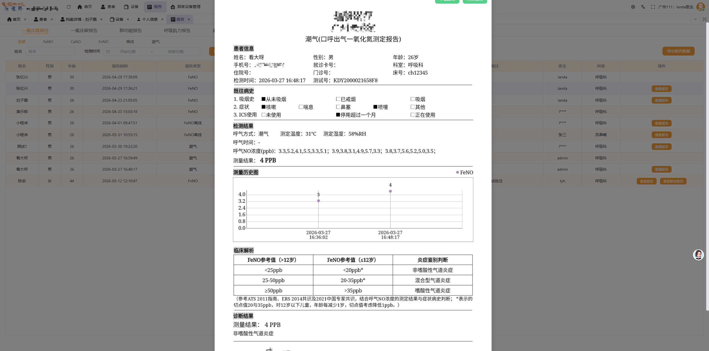

# xxx系统展示

> 这是一个面向医疗管理场景的系统界面作品集，截取展示部分页面

## 项目概览
- 场景：医疗信息管理与设备监控

## 页面

### 首页

### 个人信息

### 患者列表

### 患者详情

### 患者详情（补充展示）

### 设备管理

### 居家设备管理

### 报告管理

---

## 说明
1. 仓库内所有软件界面截图版权归属对应原任职公司；
2. 截图仅展示本人参与开发的功能模块，不含源代码、核心业务算法、保密技术资料；
3. 截图已隐去企业标识、内部涉密信息、业务敏感数据；
4. 未经权利人书面许可，任何人不得转载、商用、二次分发仓库内图片资源；
5. 如相关权利人认为内容存在侵权，请联系本人，将第一时间移除相关素材。
