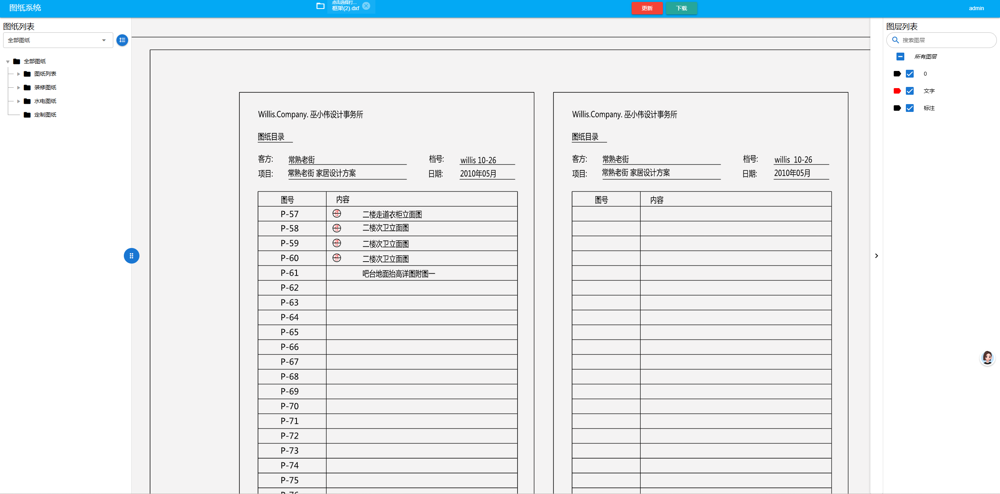

# dxf-viewer 示例



本仓库是 `dxf-viewer` 的示例应用，基于 Vue 2 构建，并使用 Quasar 进行 UI 适配，使用 Element UI 组件库，
通过 three.js 在浏览器中渲染 DXF 图形。

## 功能

- 在浏览器中加载和渲染 DXF 文件
- 支持通过 `dxfUrl` 查询参数加载外部 DXF 文件
- 使用 Web Worker 进行 DXF 解析（`DxfViewerWorker.js`）
- 提供图层列表、树状导航、查看器控件等示例 UI 组件

## 先决条件

- Node.js 16.x
- npm

## 安装

```bash
npm install
```

## 开发

```bash
npm run dev
```

开发服务器默认运行在 `9001` 端口。

## 构建

```bash
npm run build
```

该命令会使用 `vue-cli-service build --modern` 生成生产构建。

## 使用方式

在浏览器中打开应用，并添加 `dxfUrl` 查询参数加载外部 DXF 文件，例如：

```text
http://localhost:9001/?dxfUrl=https://example.com/path/to/file.dxf
```

注意：外部 DXF 加载依赖代理或 CORS 解决方案，因此某些站点可能无法直接获取文件。

## 项目结构

- `src/App.vue` - 应用主界面
- `src/main.js` - 应用入口
- `src/Quasar.js` - Quasar 集成配置
- `src/components/` - 查看器和 UI 组件
- `src/utils/tools.js` - 工具函数
- `public/index.html` - 应用 HTML 模板

## 依赖

- `vue` `^2.6.14`
- `quasar` `^1.16.0`
- `element-ui` `^2.15.14`
- `three` `^0.161.0`
- `dxf-viewer` `^1.0.42`

## 许可证

MIT
