# xx呼气分析上位机展示

>该项目仅用于xx呼气分析上位机软件部分功能截取展示

- **登录界面**：展示系统入口、用户认证与身份验证流程。

## 患者管理与录入

- **患者录入**：患者信息采集与登记界面，支持病历信息输入和初始数据填写。

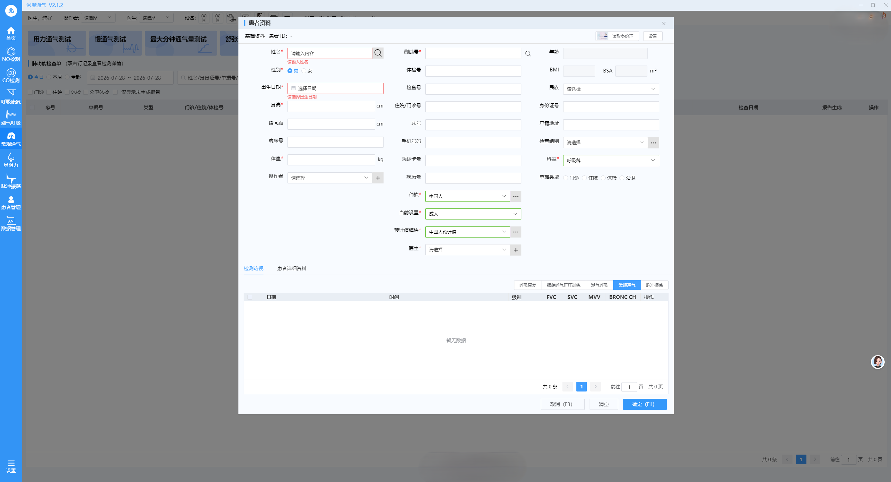

## 设备与环境管理

- **设备管理**：集中管理医疗设备，展示设备列表、状态监控与操作入口。

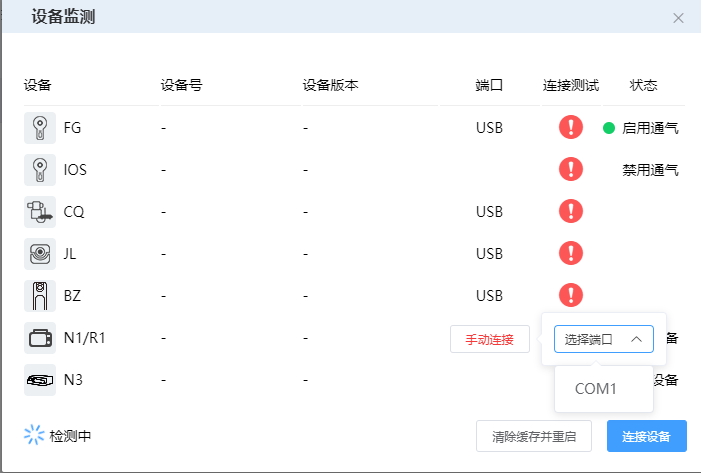

- **环境定标**：用于环境校准与系统标定，确保测量准确性的配置界面。

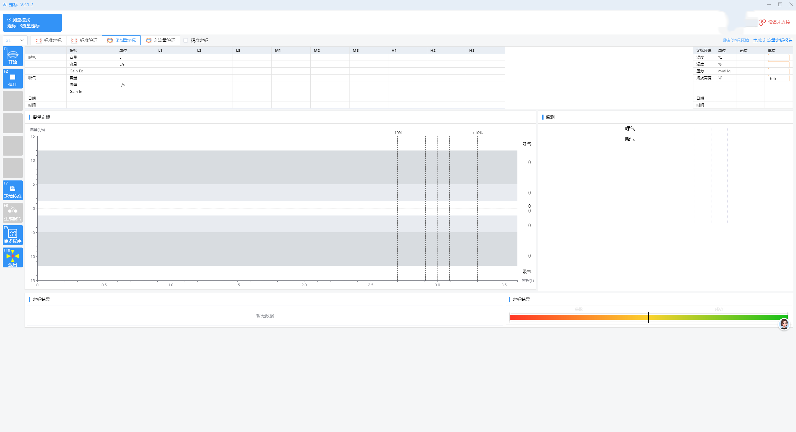

## 试验与验证流程

- **抗阻验证**：抗阻测试流程与结果展示页面。

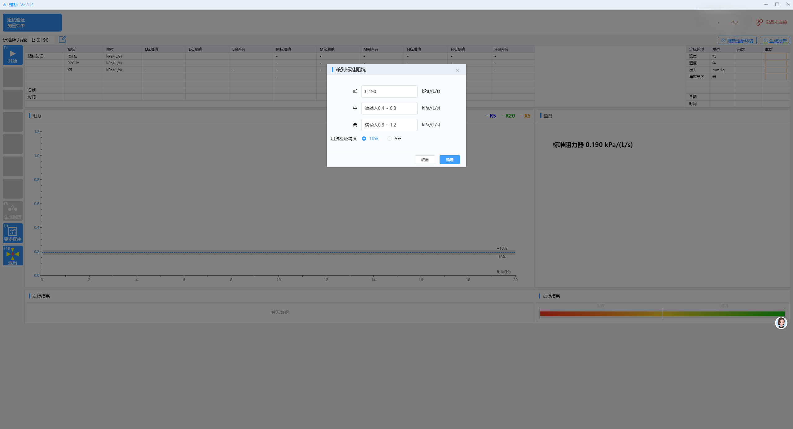

- **激发试验详情**：详细展示激发试验的参数、过程与结果分析。

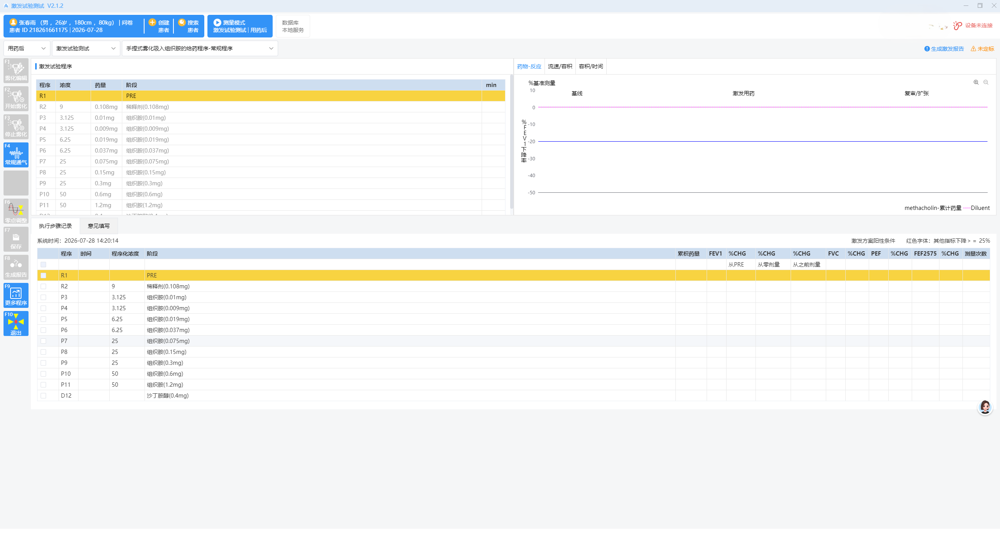

- **脉冲震荡详情**：展示脉冲震荡试验的详细信息与测试数据。

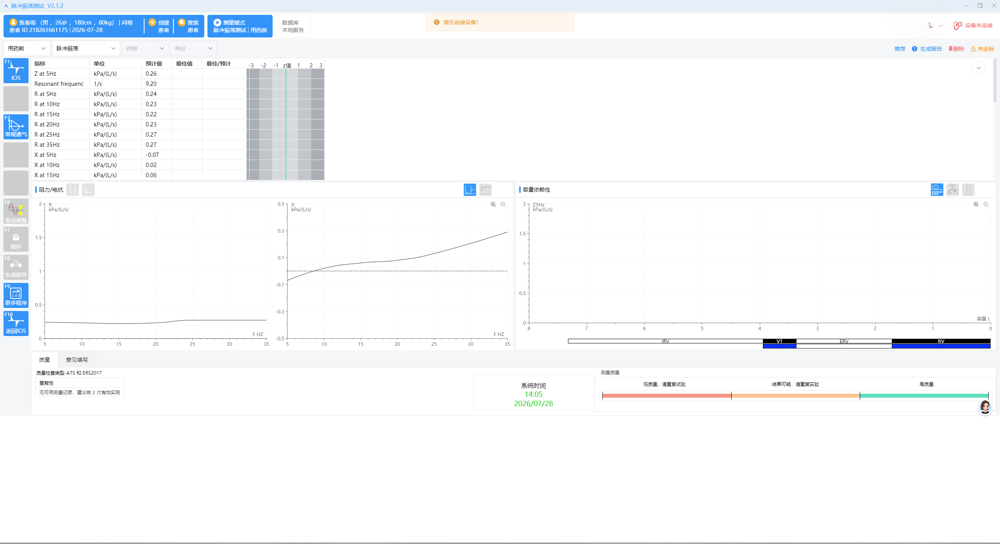

- **用力通气测试**：展示用力通气测试概况与主要测量结果。

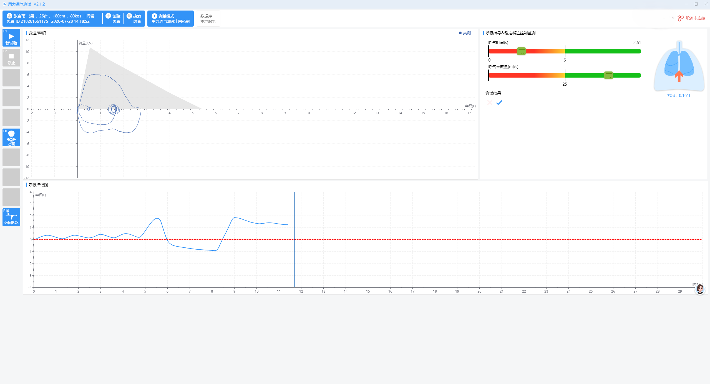

- **用力通气详情**：展示用力通气测试的详细参数与图表分析。

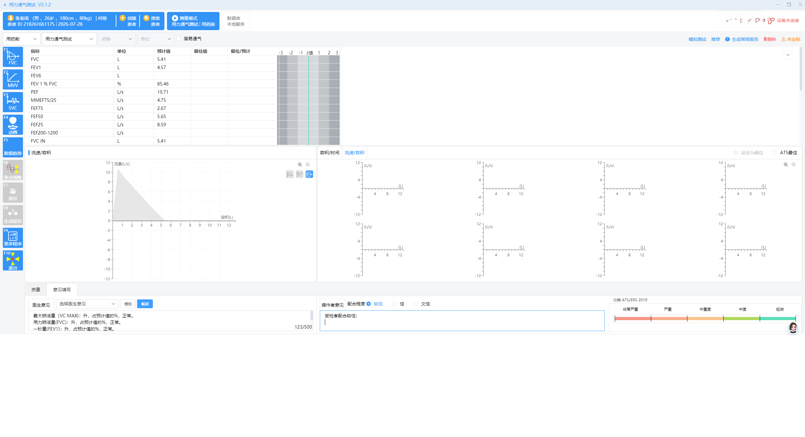

## 药剂配置

- **药剂配置**：药剂设置与管理页面，支持药物参数配置与方案制定。

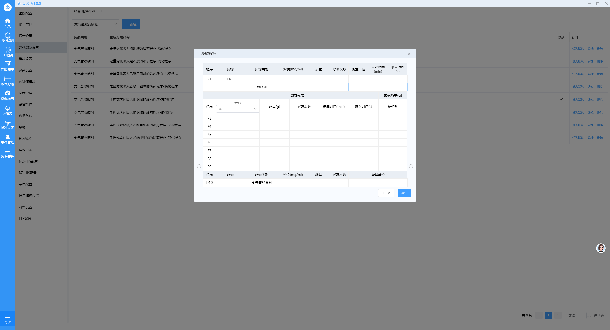

## 报告设置

- **报告设置**：报告展示设置。

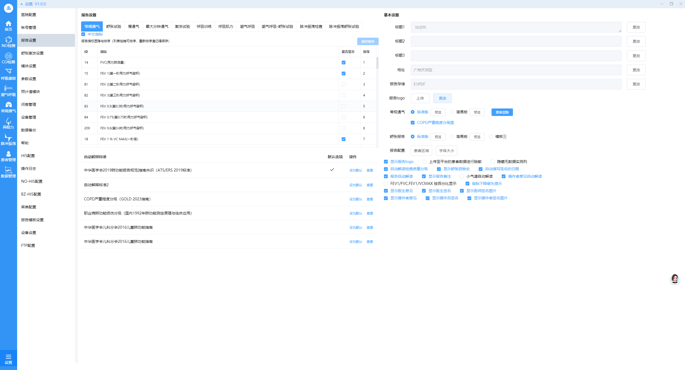

- **报告预览**：测试结果与测量报告的预览界面，展示最终输出内容。

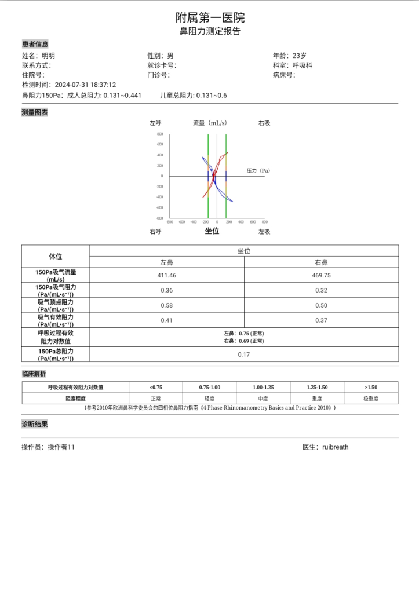
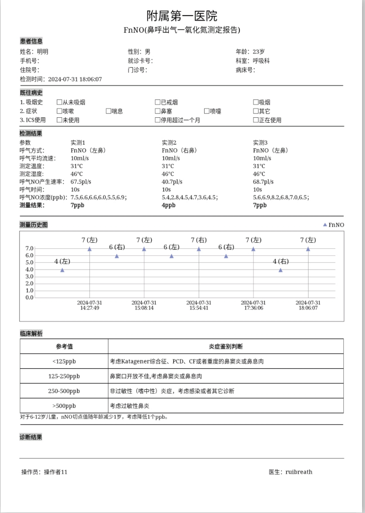
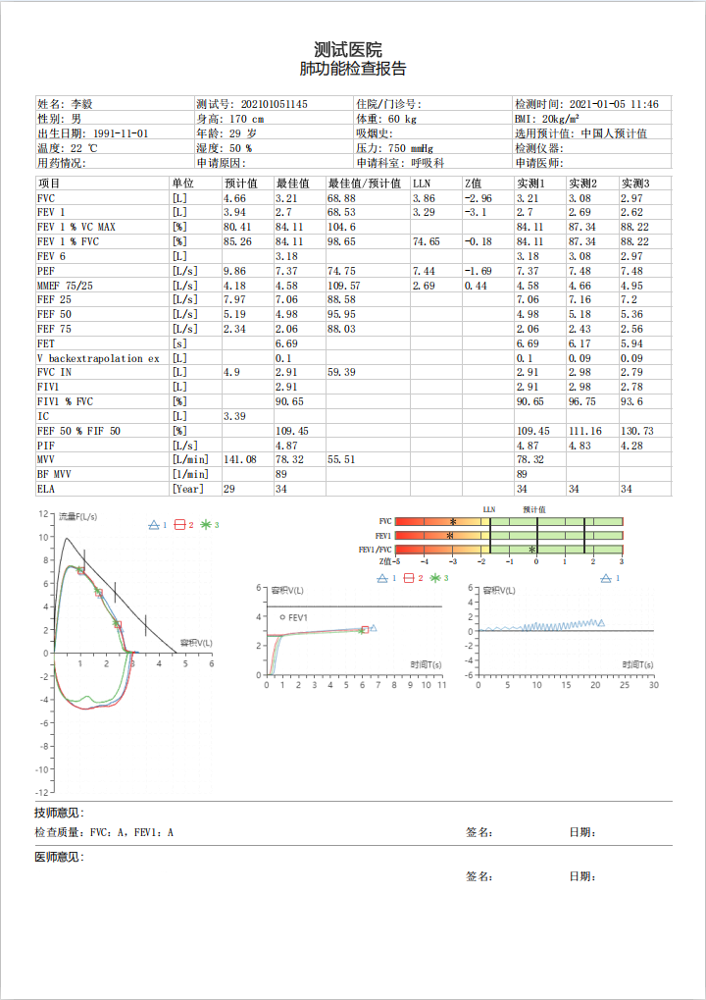
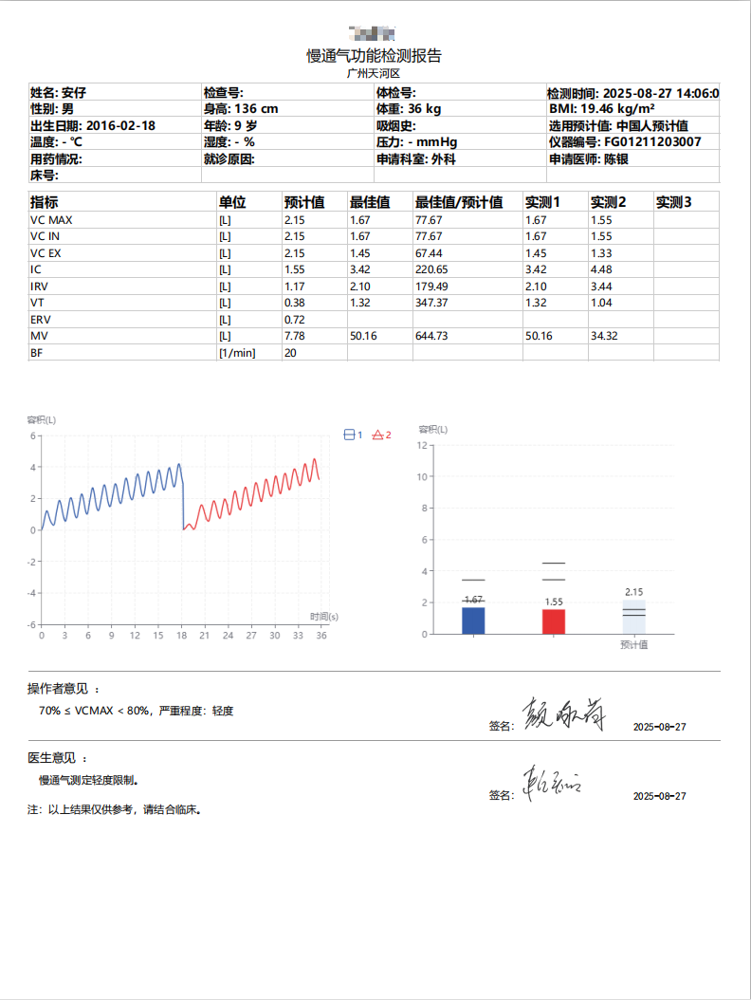
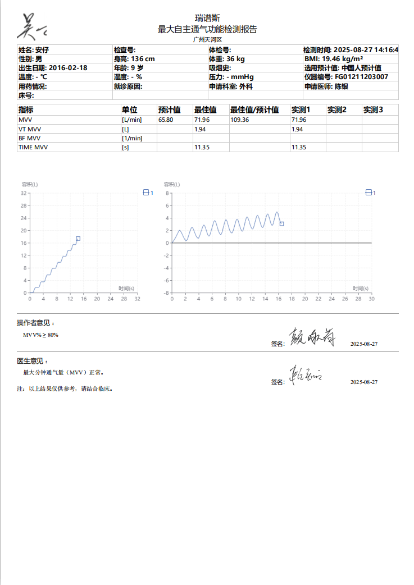
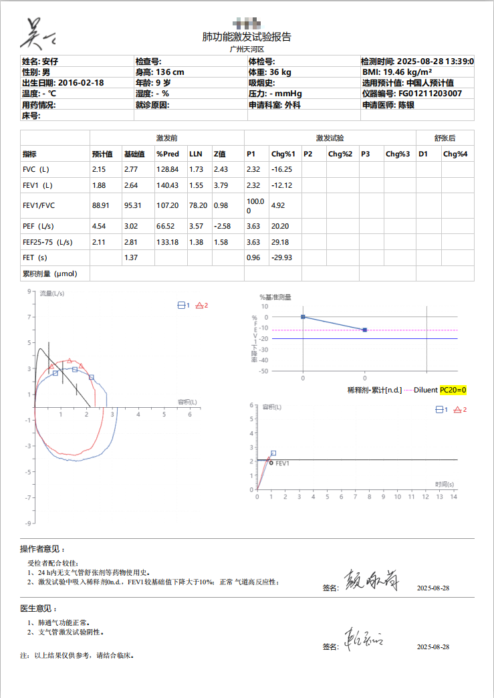
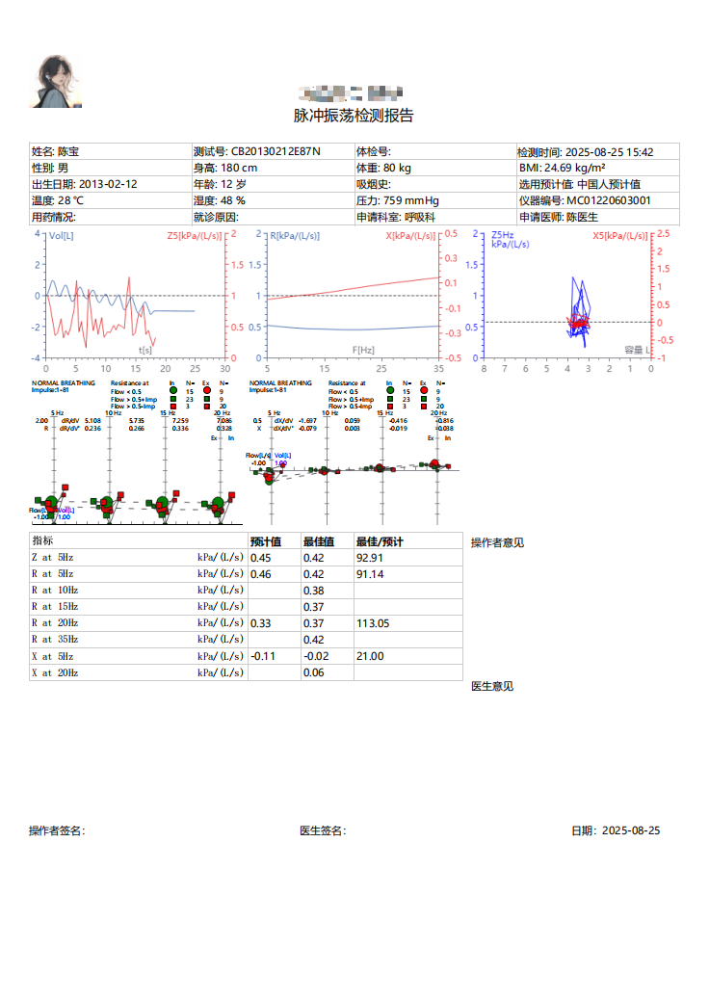

> 更多展示参考[电脑端软件操作指南](./电脑端软件操作指南20250610.docx)

## 说明
1. 仓库内所有软件界面截图版权归属对应原任职公司；
2. 截图仅展示本人参与开发的功能模块，不含源代码、核心业务算法、保密技术资料；
3. 截图已隐去企业标识、内部涉密信息、业务敏感数据；
4. 未经权利人书面许可，任何人不得转载、商用、二次分发仓库内图片资源；
5. 如相关权利人认为内容存在侵权，请联系本人，将第一时间移除相关素材。
